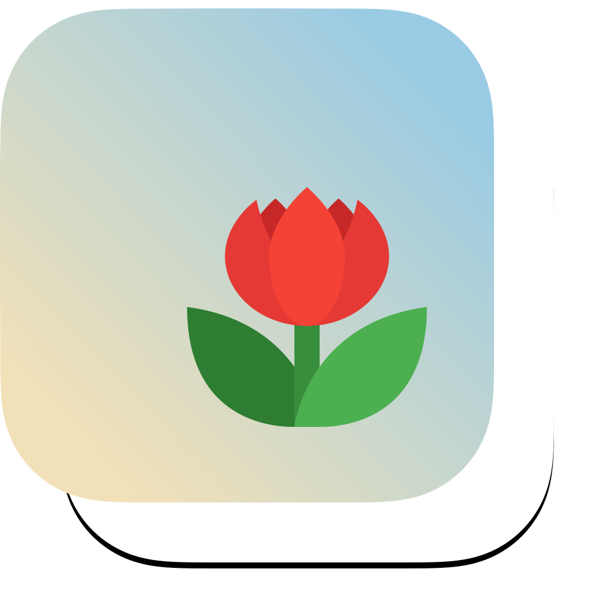
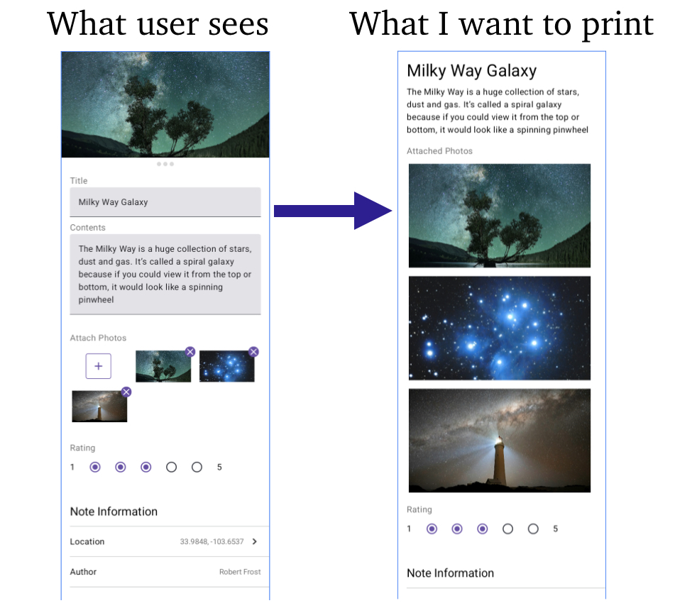

  

    
    
    

# Convert Composables into Image
Demonstrates how to convert any composable view in Jetpack into a bitmap image.

	

## More information
This is a companion repository for the [How to convert any Composable into an image](https://blog.eclypse.io/how-to-convert-any-composable-into-an-image-11219423742d) article. Please refer to the blog for more information.

## Requirements

| Android Studio | Ladybug |
|:----------|:----------|
| Java | 8 |